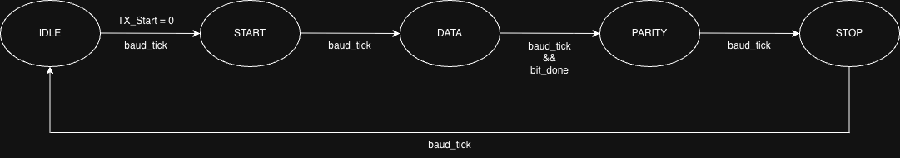
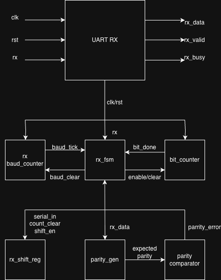
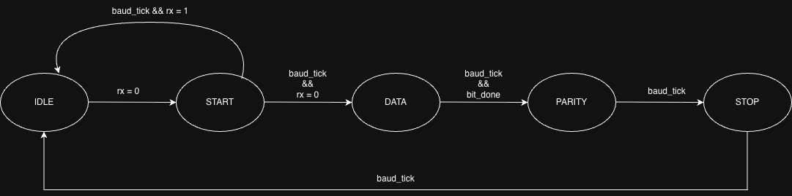
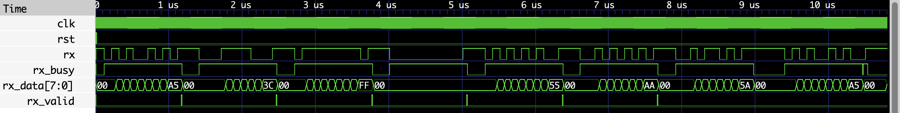
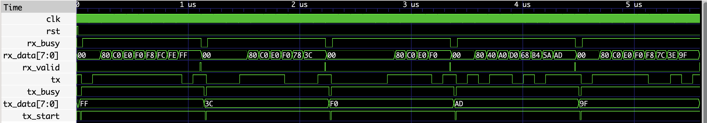

# UART in SystemVerilog

A parameterized UART (Universal Asynchronous Receiver Transmitter) — **Transmitter and Receiver** — implemented in **SystemVerilog** using a modular RTL architecture. This project was developed as part of my VLSI/ASIC design learning journey with an emphasis on reusable RTL design, finite state machines (FSMs), and parameterized hardware modules.

---

## Features

- Parameterized data width
- Configurable baud rate divider
- Even and Odd parity support (generation on TX, checking on RX)
- Modular RTL architecture shared between TX and RX (`bit_counter`, `parity_gen`)
- Finite State Machine (FSM) based controllers for both TX and RX
- Center-of-bit sampling on RX for robust start-bit detection
- Self-checking loopback testbench (TX ↔ RX)
- Verified using Icarus Verilog and GTKWave

---

## Project Structure

```text
uart-systemverilog/
│
├── rtl/
│   ├── TX/
│   │   ├── uart_tx.sv
│   │   ├── uart_fsm.sv
│   │   ├── baud_gen.sv
│   │   └── shift_reg.sv
│   │
│   ├── RX/
│   │   ├── uart_rx.sv
│   │   ├── rx_fsm.sv
│   │   ├── rx_baud_counter.sv
│   │   └── rx_shift_reg.sv
│   │
│   └── common/
│       ├── bit_counter.sv
│       └── parity_gen.sv
│
├── tb/
│   ├── uart_tx_tb.sv
│   ├── uart_rx_tb.sv
│   ├── rx_baud_counter_tb.sv
│   └── uart_loopback_tb.sv
│
├── docs/
│   ├── TX/
│   │   ├── uart_tx_block_diagram.png
│   │   ├── uart_tx_fsm.png
│   │   └── waveform.png
│   ├── RX/
│   │   ├── uart_rx_block_diagram.png
│   │   ├── uart_rx_fsm.png
│   │   └── waveform.png
│   └── loopback/
│       └── loopback_waveform.png
│
├── README.md
├── LICENSE
└── .gitignore
```

---

## UART Frame Format

Both TX and RX use the same frame format:

```text
+--------+----------------+---------+--------+
| Start  | Data (8 bits)  | Parity  | Stop   |
|   0    | LSB First      | Even/Odd|   1    |
+--------+----------------+---------+--------+
```

---

## Transmitter (TX)

The transmitter consists of four reusable RTL modules (plus the shared `bit_counter` and `parity_gen`) coordinated by `uart_fsm`, a five-state finite state machine: `IDLE -> START -> DATA -> PARITY -> STOP -> IDLE`.

The TX baud counter (`baud_gen`) restarts every time a new frame begins, so every bit — including the start bit — is always a full, correctly-timed baud period.

### Architecture


### FSM



### Simulation Result


| Module | Description |
|--------|-------------|
| `baud_gen` | Generates the TX baud tick from the system clock; restarts on every new frame so bit widths stay accurate |
| `bit_counter` | Counts transmitted bits (shared with RX) |
| `shift_reg` | Serializes parallel TX data, LSB first |
| `parity_gen` | Generates parity for the outgoing frame (shared with RX) |
| `uart_fsm` | Controls the complete transmission sequence |
| `uart_tx` | Top-level module integrating all TX submodules |

---

## Receiver (RX)

The receiver mirrors the TX structure with its own FSM and baud counter, reusing `bit_counter` and `parity_gen` from TX.

RX differs from TX in one key way: `rx_baud_counter` ticks at the **center** of each bit — a half-period first tick, then full-period ticks after — instead of at bit boundaries. This lets RX confirm the start bit is still low mid-bit (rejecting false starts / glitches) before committing to a frame, and sample every following bit away from its edges, where the signal is most stable.

### Architecture



### FSM



### Simulation Result



| Module | Description |
|--------|-------------|
| `rx_baud_counter` | Generates the RX baud tick, sampling at the center of each bit |
| `bit_counter` | Counts received bits (shared with TX) |
| `rx_shift_reg` | Deserializes incoming RX data, LSB first |
| `parity_gen` | Computes expected parity from received data, compared against the received parity bit (shared with TX) |
| `rx_fsm` | Controls the complete reception sequence |
| `uart_rx` | Top-level module integrating all RX submodules |

---

## Final Result: Loopback (TX ↔ RX)

The full TX↔RX path is verified with a self-checking loopback testbench (`uart_loopback_tb.sv`): TX transmits a sequence of bytes directly into RX's serial input, and the testbench compares each byte RX receives against what TX sent.



```text
PASS : TX=ff RX=ff
PASS : TX=3c RX=3c
PASS : TX=f0 RX=f0
PASS : TX=ad RX=ad
PASS : TX=9f RX=9f
```

---

## Simulation

### Compile & run the full loopback test

```bash
iverilog -g2012 -o uart.out rtl/TX/*.sv rtl/RX/*.sv rtl/common/*.sv tb/uart_loopback_tb.sv
vvp uart.out
```

### View a waveform

```bash
gtkwave uart.vcd
```

Individual testbenches (`uart_tx_tb.sv`, `uart_rx_tb.sv`, `rx_baud_counter_tb.sv`) can be compiled and run the same way, swapping in the relevant testbench file alongside the RTL it depends on.

---

## Future Improvements

- Configurable stop bits
- Parity enable/disable
- FIFO interface
- Formal/assertion-based verification

---

## Tools Used

- SystemVerilog
- Icarus Verilog
- GTKWave
- draw.io (Architecture & FSM diagrams)
- Git & GitHub

---

## License

This project is licensed under the MIT License.