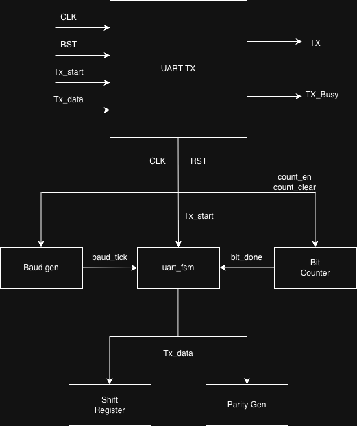
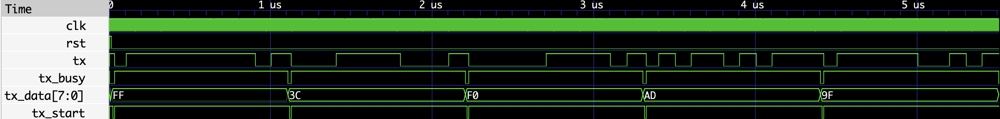

# UART Transmitter in SystemVerilog

A parameterized UART (Universal Asynchronous Receiver Transmitter) Transmitter implemented in **SystemVerilog** using a modular RTL architecture. This project was developed as part of my VLSI/ASIC design learning journey with an emphasis on reusable RTL design, finite state machines (FSMs), and parameterized hardware modules.

---

## Features

- Parameterized data width
- Configurable baud rate divider
- Even and Odd parity support
- Modular RTL architecture
- Finite State Machine (FSM) based controller
- Separate reusable modules
- SystemVerilog testbench
- Verified using Icarus Verilog and GTKWave

---

## Project Structure

```text
uart-systemverilog/
│
├── rtl/
│   ├── uart_tx.sv
│   ├── uart_fsm.sv
│   ├── baud_gen.sv
│   ├── bit_counter.sv
│   ├── shift_reg.sv
│   └── parity_gen.sv
│
├── tb/
│   └── uart_tb.sv
│
├── docs/
│   ├── uart_tx_block_diagram.png
│   ├── uart_tx_fsm.png
│   └── waveform.png
│
├── README.md
├── LICENSE
└── .gitignore
```

---

## Architecture

The UART transmitter consists of five reusable RTL modules coordinated by a finite state machine.



---

## FSM

The transmitter is controlled by a five-state finite state machine.

- IDLE
- START
- DATA
- PARITY
- STOP


---

## UART Frame Format

```text
+--------+----------------+---------+--------+
| Start  | Data (8 bits)  | Parity  | Stop   |
|   0    | LSB First      | Even/Odd|   1    |
+--------+----------------+---------+--------+
```

---

## Modules

| Module | Description |
|--------|-------------|
| `baud_gen` | Generates baud tick from system clock |
| `bit_counter` | Counts transmitted bits |
| `shift_reg` | Serializes parallel input data |
| `parity_gen` | Generates even or odd parity |
| `uart_fsm` | Controls the complete transmission sequence |
| `uart_tx` | Top-level module integrating all submodules |

---

## Simulation

### Compile

```bash
iverilog -g2012 -o uart_tb.out rtl/*.sv tb/uart_tb.sv
```

### Run

```bash
vvp uart_tb.out
```

### View Waveform

```bash
gtkwave uart.vcd
```

---

## Simulation Result

The UART transmitter was verified using GTKWave.



---

## Future Improvements

- UART Receiver (RX)
- Configurable stop bits
- Parity enable/disable
- Self-checking testbench
- Loopback (TX ↔ RX)
- FIFO interface

---

## Tools Used

- SystemVerilog
- Icarus Verilog
- GTKWave
- draw.io (Architecture & FSM diagrams)
- Git & GitHub

---

## License

This project is licensed under the MIT License.
